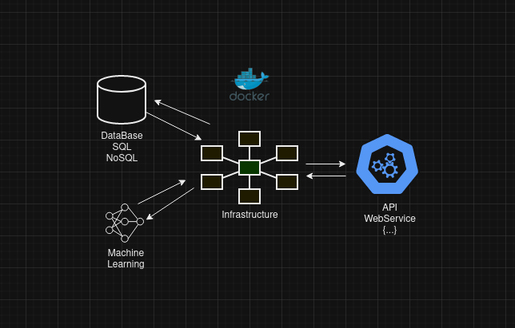

# Gustavo Vinicius de Morais Pereira

Welcome to my GitHub page.  
I’m an experienced Backend Developer with the technologies PHP, SOLID, Design Patterns, Laravel, Composer, SQL, Docker, Git, NGINX. 
As a professional, I like to work with:
- Building and maintaining REST APIs WebServices
- Database queries
- Data Engineering

### Main Tech Skills
PHP, SOLID, Design Patterns, Laravel, Composer, SQL, Docker, Git, NGINX.

### Secondary Skill
TDD, Python, Data Engineering, Machine Learning.

### Diagram showing what I like to do

### Project Managment Skills
SCRUM, Example Mapping, User Story Mapping, Agile Planning (KWL, Mind Maps, Flow Charts, Impact Effort Matrix, ROADMAP).

### Main projects
- [Laravel API](https://github.com/GustavoViniciusdeMorais/Laravel_Studies/tree/api-ddd)
- [Databases](https://github.com/GustavoViniciusdeMorais/Database_Studies)
- [Computer Networking](https://github.com/GustavoViniciusdeMorais/Hacking_Studies/tree/virtual-network)
- [Data Science](https://github.com/GustavoViniciusdeMorais/DataScience_Studies/tree/simple-classification)

### My Achievements
- [Information Technology College Degree](./achievements/DegreeGradesHistory.pdf)
- [Zend Certified PHP Engineer](./achievements/PHP_Engineer_GustavoMorais.pdf)
- [Data Science Post Degree](./achievements/DataScienceDegreeGrades.pdf)
- [Itil Foundation Certification](./achievements/itil.png)

### My published articles
- [Agile Task Planing](https://medium.com/@gustavoviniciusmoraisti/agile-task-planning-for-system-developers-585fed59b09d)

### Contact info
- Email: gustavoviniciusmoraisti@gmail.com
- [Linkedin Profile](https://www.linkedin.com/in/gustavo-vinicius/)

<!-- - [My Laravel Course For Beginers](https://www.udemy.com/course/laravel-8-quick-start/) -->

<!-- ### Visit my mobile game at amazon store
[X-Monstro](https://www.amazon.com/gp/product/B0BY7814RC) -->
