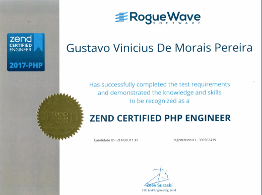
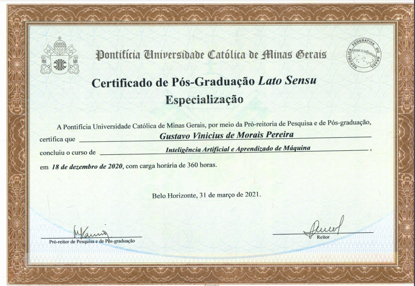
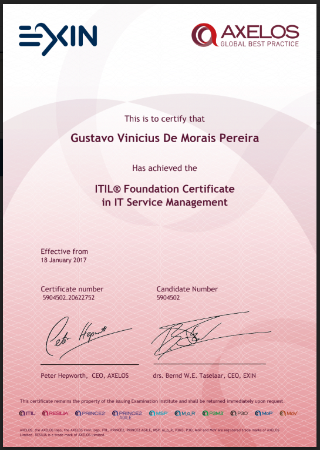

# Gustavo Vinicius de Morais

Welcome to my GitHub page.

I’m an experienced Back-End Developer with the technologies PHP, Laravel, Composer, MySQL, Docker, Git.

I like to build systems, REST API’s and games.

### Main Tech Skills
PHP, Laravel, Composer, MySQL, Docker, Git.

### Secondary Skill
Machine Learning, Unity, C#, Python, NodeJS, Java

### Project Managment
SCRUM, Example Mapping, Agile Planning (KWL, Mind Maps, Flow Charts, Impact Effort Matrix, ROADMAP).

[Linkedin Profile](https://www.linkedin.com/in/gustavo-vinicius/)
 
[Zend Certified PHP Engineer](https://www.zend-zce.com/en/yellow-pages/ZEND031130)
 
[My Laravel Course For Beginers](https://www.udemy.com/course/laravel-8-quick-start/)

### My Achievements

