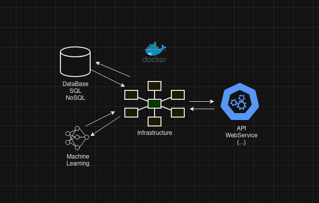

# Gustavo Vinicius de Morais Pereira

Welcome to my GitHub page.  
I am an experienced Backend Developer with a deep focus on the infrastructure layer and server-side programming. 
My professional mission is to build resilient, scalable systems, with the long-term goal of becoming a DevOps Engineer. 
I am a dedicated Linux power user and a firm believer in the "learn, teach, and grow" philosophy, always looking for ways to support my colleagues and improve engineering culture. 
### As a professional, I like to work with:
- Building and maintaining REST APIs WebServices
- Database queries
- Linux Admin
- Data Engineering

### Main Tech Skills
Skills summary: PHP (Laravel, Composer), SOLID, Design Patterns, SQL, Git, Docker, Web Services (Apache, NGINX), Restful API, Linux, Bash Scripting.

### Secondary Skill
TDD, Python, Data Engineering, Machine Learning.

### Diagram showing what I like to do

### Project Managment Skills
SCRUM, Example Mapping, User Story Mapping, Agile Planning (KWL, Mind Maps, Flow Charts, Impact Effort Matrix, ROADMAP).

### Main projects
- [My PHP Router](https://github.com/GustavoViniciusdeMorais/MyPHPFramework)
- [PHP Studies](https://github.com/GustavoViniciusdeMorais/PhpProjectSetup)
- [Laravel API](https://github.com/GustavoViniciusdeMorais/Laravel_Studies/tree/api-ddd)
- [Linux Admin](https://github.com/GustavoViniciusdeMorais/LinuxAdmin)
- [Databases](https://github.com/GustavoViniciusdeMorais/Database_Studies)
- [Computer Networking](https://github.com/GustavoViniciusdeMorais/Hacking_Studies/tree/virtual-network)
- [Data Science](https://github.com/GustavoViniciusdeMorais/DataScience_Studies/tree/simple-classification)

### My Achievements
- [Information Technology College Degree](./achievements/DegreeGradesHistory.pdf)
- [Zend Certified PHP Engineer](./achievements/PHP_Engineer_GustavoMorais.pdf)
- [Data Science Post Degree](./achievements/DataScienceDegreeGrades.pdf)
- [Software Engineering Post Degree](./achievements/DegreeSoftwareEngineering.pdf)
    - [Grades](./achievements/SoftwareEngineeringHistoricalGrades.pdf)
- [Itil Foundation Certification](./achievements/itil.png)

### My published articles
- [Agile Task Planing](https://medium.com/@gustavoviniciusmoraisti/agile-task-planning-for-system-developers-585fed59b09d)

### Contact info
- Email: gustavoviniciusmoraisti@gmail.com
- [Linkedin Profile](https://www.linkedin.com/in/gustavo-vinicius/)

<!-- - [My Laravel Course For Beginers](https://www.udemy.com/course/laravel-8-quick-start/) -->

<!-- ### Visit my mobile game at amazon store
[X-Monstro](https://www.amazon.com/gp/product/B0BY7814RC) -->
