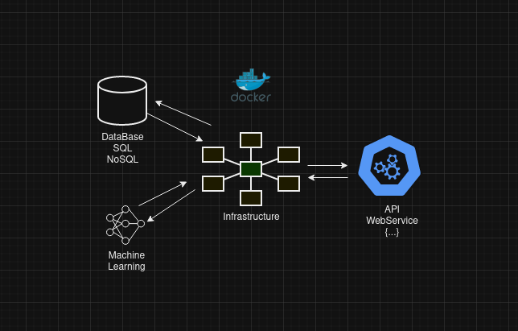

  
  

    
    

  

### :technologist: About Me :
- :telescope: I’m working as a Software Engineer and contributing to backend for building REST APIs WebServices.

- :seedling: Exploring Technical Content Writing.

- :zap: In my free time, I study and read tech articles.

- :mailbox:How to reach me: 

### :hammer_and_wrench: Languages and Tools :

  &nbsp;
  &nbsp;
  &nbsp;
  &nbsp;
  &nbsp;
  &nbsp;
  &nbsp;
  &nbsp;
  &nbsp;
  &nbsp;
  &nbsp;
  &nbsp;
  &nbsp;
  &nbsp;
  &nbsp;
  &nbsp;
  &nbsp;
  &nbsp;
  &nbsp;

 

